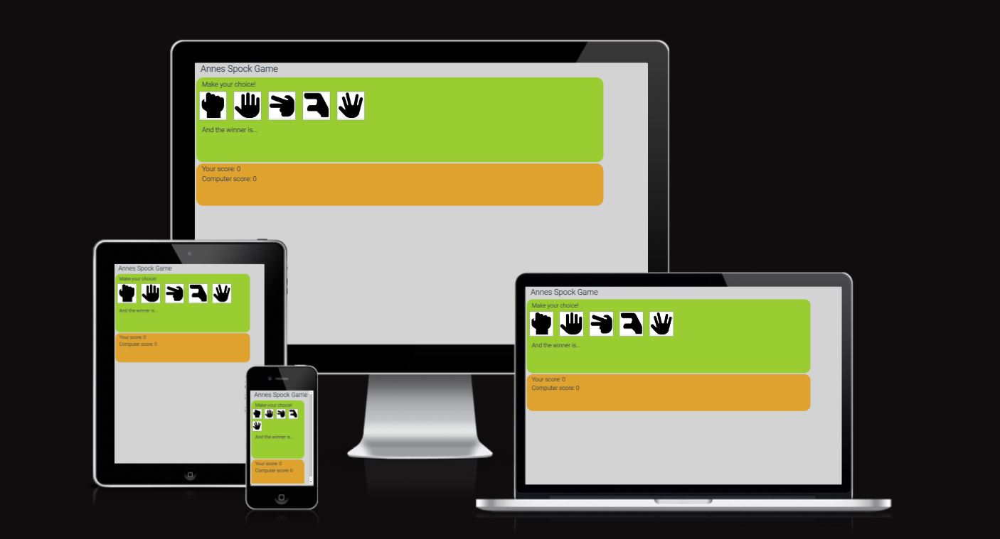
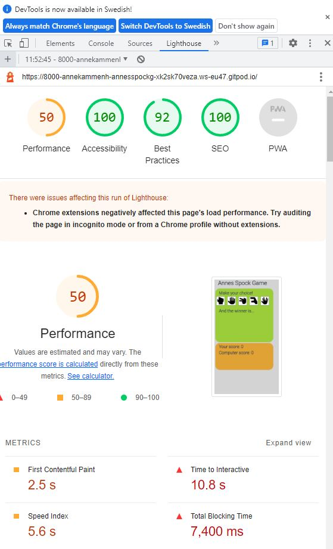

<h1>Welcome to Annes Spock Game!</h1>

`python3 -m http.server`

<h2>Who is it for?</h2>
The game is for users who are interested in playing a fun, online game. The colour scheme is inspired by star-trek.

<h3>Remember the rules:</h3>
<ul>
<li>Scissors cuts Paper</li>
<li>Paper covers Rock</li>
<li>Rock crushes Lizard</li>
<li>Lizard poisons Spock</li>
<li>Spock smashes Scissors</li>
<li>Scissors decapitates Lizard</li>
<li>Lizard eats Paper</li>
<li>Paper disproves Spock</li>
<li>Spock vaporizes Rock</li>
<li>Rock crushes Scissors</li>
</ul>

<h2>Features</h2>
The page consists of a header with the logo, a div with the game area and a footer with scores. 

The game area has five button with images that when clicked run the game. 

Underneath the images in the game area there is a message with the outcome of the game is visible - who wins? - who loses? 

The footer adds up the wins for the player and the computer. 

<h2>Testing</h2> 

</img>

I ran lighthouse a couple of times and got 100% accessibility the last check:

</img>

I also ran the code in: 

html in https://validator.w3.org/

css in https://jigsaw.w3.org/css-validator/

javascript in https://jshint.com/

The w3 validators for html and css come back without any errors or warnings. 

<h2>Bugs</h2>
To be able to follow the logic step by step and learn along the way, I wanted to bild the game with an if-else-statement. The if else worked for some of the rules and not for others. Since I couldn't get the code to work with the five options, I built out a game with only two options first. Link to that code below. To make the rule shorter in the finished game, I've changed it to switch.

The JS-hint test comes back with 14 warnings: "'const' is available in ES6 (use 'esversion: 6') or Mozilla JS extensions (use moz).".

<h2>Where can I find the site and the code?</h2>
The game built with an if else if statment with two alternatives is here: https://github.com/AnneKammenhed/project2new

The code for AnnesSpockGame, project two is here: https://github.com/AnneKammenhed/annes-spock-game

The deployed site for project two is here: https://annekammenhed.github.io/annes-spock-game/

<h2>Credits</h2>
The site is built on the Code Institute student template for Gitpod. Inspiration has been taken from the love maths project and the rock, paper, scissors game provided by the Code Institute. I also browsed though some other games on github and youtube to get inspiration.

The pictures are from Fontawesome and the font is from Google fonts.